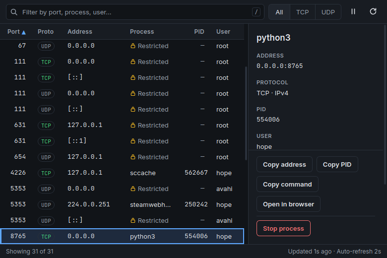

# Portside

What is listening on this port, and can I stop it? Portside lists every listening TCP socket and bound UDP socket on a Linux machine, shows the owning process, and stops it safely (SIGTERM, with an explicit Force stop if it doesn't exit). It reads `/proc` directly, never spawns a shell, and never asks for elevated rights.



## Install

Built packages land in `src-tauri/target/release/bundle/`:

```sh
sudo apt install ./src-tauri/target/release/bundle/deb/Portside_0.1.2_amd64.deb   # then launch "Portside" from the menu
# or, without installing:
./src-tauri/target/release/bundle/appimage/Portside_0.1.2_amd64.AppImage
```

Prefer the `.deb`: it starts faster (about 0.6 s against about 0.8 s; see [Limits](#limits)).

## Build

Requires Rust (stable), Node 20+, and the Tauri Linux prerequisites:

```sh
sudo apt install libwebkit2gtk-4.1-dev libgtk-3-dev librsvg2-dev build-essential file libssl-dev
npm install
npm run tauri dev       # run in development (Vite on :1420 + debug binary)
npm run tauri build     # release binary + .deb + AppImage under src-tauri/target/release/bundle/
npm run repack-appimage # then repack the AppImage for faster startup (see Limits)
```

## Tests

```sh
cd src-tauri && cargo test && cargo clippy --all-targets -- -D warnings && cd ..
npx tsc --noEmit && npx vitest run
```

- `cargo test`: `/proc/net` parsers against fixture copies in `src-tauri/tests/fixtures/`, stat/cmdline/passwd parsing, the stop flow against real spawned `sleep` processes, and one live scan of this machine.
- `vitest run`: filter, sort, diff-merge, address/URL formatting and dialog wording in `src/logic.ts`.

## Project layout

```
src-tauri/src/
  lib.rs        Tauri commands (scan_sockets, stop_process), window/theme setup
  model.rs      IPC types; mirrored by src/types.ts, so change both together
  proc_net.rs   /proc/net/{tcp,tcp6,udp,udp6} parser
  procs.rs      inode→PID map, comm/cmdline/start time, /etc/passwd
  stop.rs       start-time check, SIGTERM/SIGKILL, 250 ms exit polling
src/
  App.tsx       state, 2 s refresh loop, shortcuts, dialogs, toasts
  Table.tsx     socket grid;  Details.tsx  details panel;  Dialog.tsx  modals
  logic.ts      pure filter/sort/merge/format helpers (+ logic.test.ts)
  styles.css    design tokens (DESIGN.md §4) and layout
scripts/
  repack-appimage.sh  post-build AppImage repack for faster startup (npm run repack-appimage)
docs/screenshots/  dark, light, confirm dialog, narrow layout
```

`SPEC.md` (behaviour) and `DESIGN.md` (visuals) are the source of truth. See `HANDOFF.md` for current state and `TODO.md` for open work.

## Keyboard shortcuts

| Key | Action |
|---|---|
| `/` or `Ctrl+F` | Focus filter |
| `Esc` | In filter: clear it, then return focus to list · In dialog: cancel |
| `↑` / `↓` | Move selection |
| `Home` / `End` | First / last row |
| `PgUp` / `PgDn` | Move by a page |
| `Enter` | From filter: focus list and select first row |
| `Alt+1` / `Alt+2` / `Alt+3` | Protocol All / TCP / UDP |
| `Ctrl+C` | Copy address of selected row |
| `Ctrl+Shift+C` | Copy PID |
| `O` | Open in browser (TCP rows) |
| `Delete` | Stop selected process |
| `P` | Pause / resume auto-refresh |
| `F5` or `Ctrl+R` | Refresh now |
| `?` | Show shortcuts overlay |

Filter tips: `30` matches ports starting with 30; `:8080` matches port 8080 exactly; any other text matches process, command line, user and address.

## Limits

Startup: the `.deb` (or the release binary) shows a populated list in about 0.6 s. The AppImage takes about 0.8 s: it mounts its image on every launch, so `npm run repack-appimage` stores it uncompressed to skip decompressing the bundled WebKit. That makes the file 225 MB instead of 76 MB. Install the `.deb` if startup time or download size matters.

Sockets owned by other users show as **Restricted**: without root, `/proc/<pid>/fd` of other users can't be read, so their process can't be identified or stopped. This is by design.
